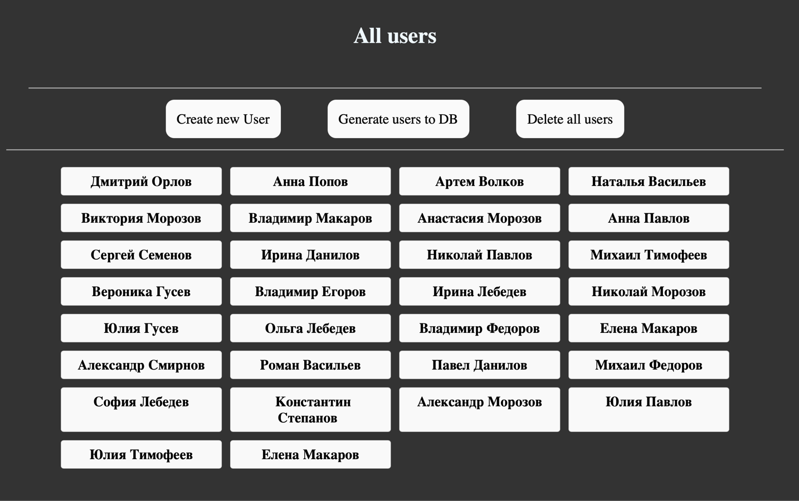
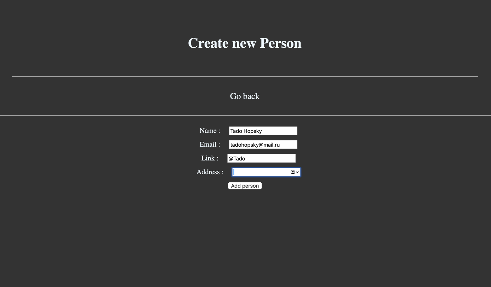
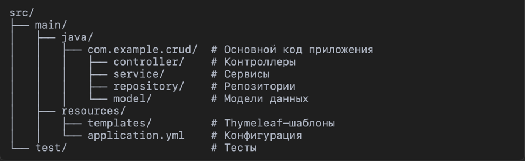

# CRUD SpringApp

## Описание проекта

**CRUD SpringApp** — это учебный проект для демонстрации реализации базовых операций CRUD (Create, Read, Update, Delete) с использованием Spring Boot, Thymeleaf, и базы данных.

Этот проект поможет понять, как работать с такими технологиями, как:

- **Spring Boot** — основной фреймворк для создания RESTful-приложений.
- **Thymeleaf** — шаблонизатор для построения пользовательского интерфейса.
- **JPA/Hibernate** — работа с базой данных.
- **H2 Database** — встроенная база данных для тестирования.

## Функционал

- Добавление новых записей.
- Просмотр всех записей.
- Редактирование существующих записей.
- Удаление записей.

## Установка и запуск

### Требования

Перед началом убедитесь, что у вас установлены:

- **Java** (версия 11 или выше)
- **Maven** (для сборки проекта)

### Инструкции по запуску

1. Клонируйте репозиторий:

   ```bash 
   git clone https://github.com/TadoHopsky/CRUD-SpringApp.git
   
2.	Перейдите в папку проекта:
   ```bash 
   cd CRUD-SpringApp
   ```
3.	Соберите проект с помощью Maven:

   ```bash 
   mvn clean install
   ```
4.	Запустите приложение:
   ```bash 
   mvn spring-boot:run
```
5.	Откройте браузер и перейдите по адресу:
6. ```bash
   http://localhost:8080 
   ```

### Используемые технологии

	•	Spring Boot 3.x
	•	Thymeleaf
	•	JPA/Hibernate
	•	H2 Database
	•	Maven

### Скриншоты
•	Главная страница


•	Форма добавления записи



## Структура проекта

